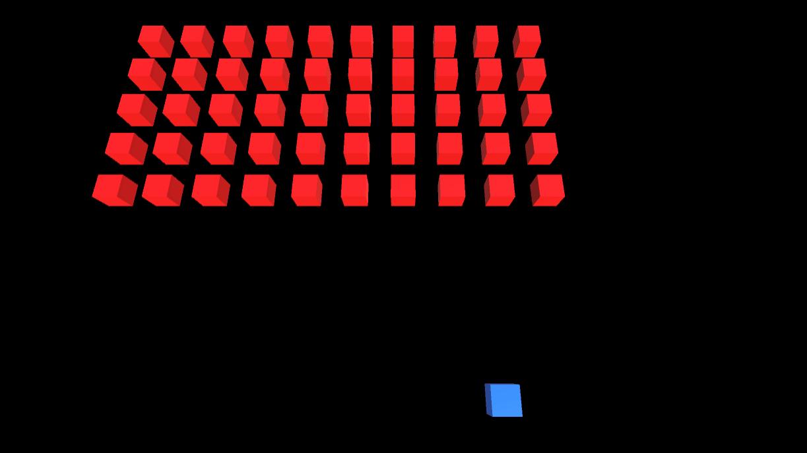
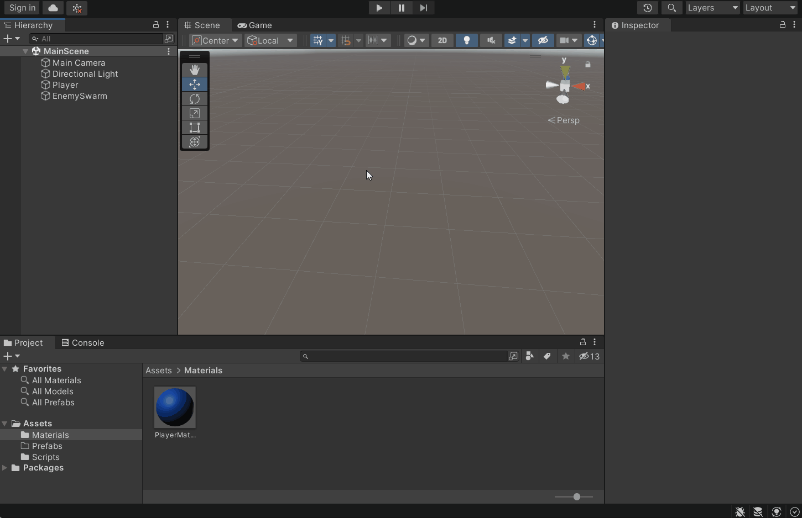
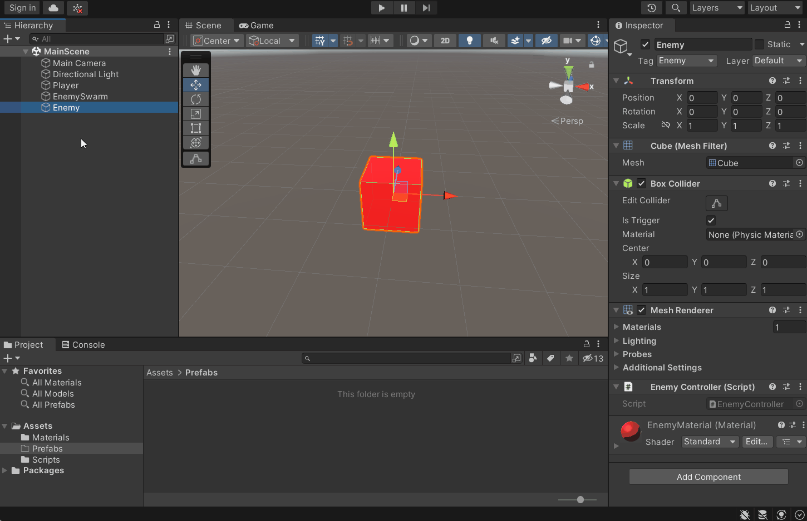
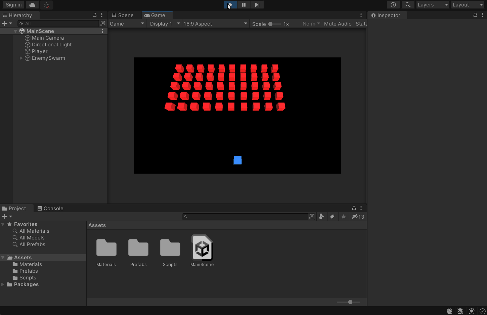
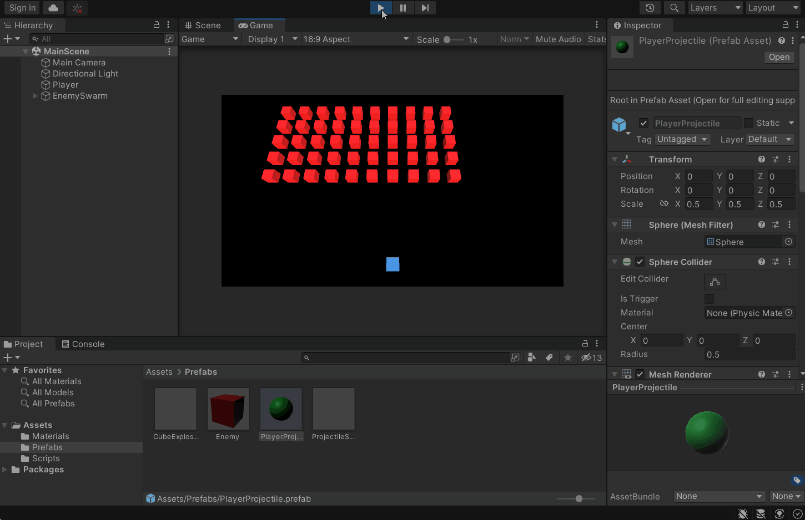
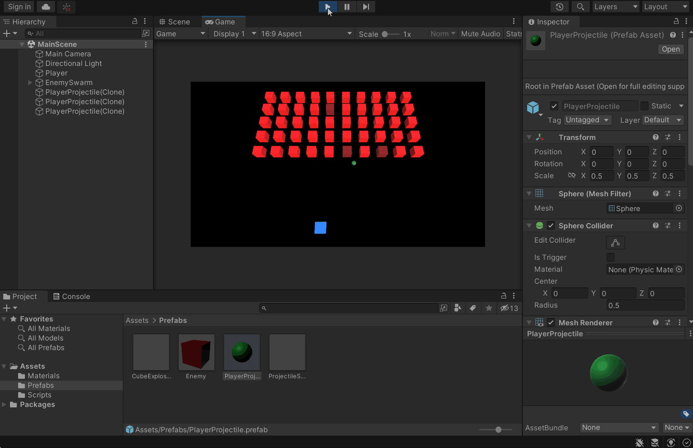
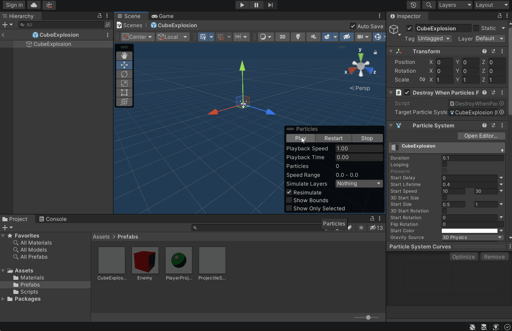

**The University of Melbourne**
# COMP30019 – Graphics and Interaction

## Workshop 4: Gameplay Elements (Part 1)

  

  

### Overview

In this workshop you will begin to develop a simple game called _Cube
Invaders_. In particular, you will practice using the component based
architecture offered by Unity, and learn how it can be used to put together
interactive applications rapidly. The game will be rendered in a 3D
environment, but will be played in the x-z plane (in other words, it's a "2.5D"
game). 

### Tasks

#### 1. Familiarise yourself with the template

Open `MainScene.unity` in Unity. Press the "Play" button. You’ll notice that a
"player ship" is at the bottom of the screen, and can move left and right when
you press the respective arrow keys. Now open the `PlayerController.cs` and
examine the code. Notice how `Input.GetKey()` is used to poll whether the left
and/or right arrow keys are currently pressed every frame. The
`transform.Translate()` method applies a translation accordingly. At this point
it might help to re-familiarise yourself with the Unity
[`Input`](https://docs.unity3d.com/ScriptReference/Input.html) class, as well
as the [`Transform`](https://docs.unity3d.com/ScriptReference/Transform.html)
component API.

#### 2. Create an enemy

Create a cube game object to serve as an enemy. Also create a red material
asset, like the player's material currently, and apply this to the enemy. At
this stage the enemy will not do anything when the game is run, it's just a
placeholder.

  

#### 3. Make it a prefab

Create a *prefab* from the enemy object you created. This can be done simply by
dragging the game object from the hierarchy to the assets folder. Making the
enemy a prefab will allow it to be instantiated such that you can place many
identical enemies in the scene. Importantly, if a modification is made directly
to the prefab, then every instance of it will automatically reflect the
modification.

> **Note** 
> Prefabs are an essential tool in Unity game development, and can save you a
> lot of time if used effectively. If you haven't already, make sure you have
> an in-depth read of the respective Unity manual
> [pages](https://docs.unity3d.com/Manual/Prefabs.html) discussing the prefab
> system in detail.

  

#### 4. Generate a swarm of enemy cubes (yikes!)

Delete the enemy game object (_not_ the prefab) from the scene. Remember that
because you created a prefab asset from the enemy earlier, the "template" to
produce enemies is still there! You will now write some game logic to
instantiate a swarm of enemies and bring them to life, using this prefab as the
template.

  

Open the script `SwarmManager.cs`. Notice that it is currently attached to the
**EnemySwarm** game object. Complete the `GenerateSwarm()` method in
`SwarmManager.cs`. The method should instantiate a swarm of enemies in a "grid"
formation. Make use of the already given serialized fields to determine the
number of rows and columns the grid of enemies comprises of, as well as the
spacing between enemy cube instances. You will need to use the
[`Instantiate()`](https://docs.unity3d.com/ScriptReference/Object.Instantiate.html)
method to create actual instances of the given prefab reference. Ensure the
serialized field in the editor is correctly assigned the enemy prefab you
created, currently stored in the game assets. A drag and drop will do the
trick, as usual.

It's a good idea to make the enemies "children" of the swarm manager game
object in the object hierarchy. This way, transforming the swarm object will
transform all the enemies together, without the need for maintaining an
explicit list of enemy instances. You may use the
[`transform.SetParent()`](https://docs.unity3d.com/ScriptReference/Transform.SetParent.html)
method to do this, or it's also possible to do it by using one of the
[`Instantiate()`](https://docs.unity3d.com/ScriptReference/Object.Instantiate.html)
method overloads.

#### 5. Animate the swarm, classic space-invaders style

Now complete the `StepSwarm()` method in `SwarmManager.cs`. This method should
move all the enemies across the screen one step. If the enemy swarm has reached
the edge of the playing area, the enemies should move down one step and reverse
their stepping direction, just like classic space invaders. Note that the
script already contains logic to call `StepSwarm()` every `stepTime` seconds. 

> **Note** 
> We use a _coroutine_ to periodically step the swarm, however we could have
> also achieved this by using a private timer variable that is incremented
> every frame and resets when it exceeds `stepTime`. This is bit messy though,
> and a coroutine offers an arguably cleaner way to solve this problem. If you
> are interested in learning more about coroutines, check out [this
> page](https://docs.unity3d.com/Manual/Coroutines.html).

  

#### 6. Engage your defenses!

Create a new prefab which represents a player projectile. Pressing 'Space' 
should fire a projectile instance upwards towards the enemy swarm. If the 
projectile collides with an enemy cube, it should be destroyed as well as the 
projectile itself. You will find the [`Destroy()`](https://docs.unity3d.com/ScriptReference/Object.Destroy.html) 
method comes in handy here. 

> **Warning** 
> Ensure that projectiles which miss and fly off the screen are eventually
> destroyed. Otherwise you'll be creating a 'memory leak' of sorts, at least
> until the scene ends. Try to create a component that can be re-used for this
> purpose, e.g., when attached to any game object, it will automatically
> destroy it if it's no longer visible.

  

#### 7. Stronger enemies...

Modify the game such that the enemies have health, and so aren’t destroyed by
just one projectile. Enemies should change visually in some way to reflect the
loss in health (i.e. darken in colour). You should think about designing any
components you create for this in a modular and reusable way. For example, you
could create a `HealthManager.cs` script which simply tracks the "health" of a
game object. This could eventually be used for different types of enemies,
"bosses" and the player themselves. Even static/non-living objects could
eventually make use of it, if they can be destroyed by projectiles.

For an extra challenge, you can try making use of [Unity events](https://docs.unity3d.com/ScriptReference/Events.UnityEvent.html), such
that an event is fired when an object is destroyed, or health is depleted. This
is another useful tool that helps further decouple components and maximise
re-usability. If you can't figure this out yourself, don't worry, the solution
will provide an example approach. 

  

#### 8. Particle effects

Using a [particle system](https://docs.unity3d.com/ScriptReference/ParticleSystem.html), generate
a suitable 'explosion' effect that is triggered when an enemy cube is
destroyed. Prefabs will once again be your friend. Ensure the explosions are
randomly varied in some way from enemy to enemy. Feel free to be creative with
this exercise, and try tuning all the different particle attributes in the
editor interface -- there are heaps!

Also create some separate "spark" particles for the projectile when it is
destroyed against an enemy cube. The sparks should fire in the _opposite_
direction to the projectile's velocity in order to provide a sense of impact.
Again think about the potential re-usability of what you create. The enemies
will eventually fire their own projectiles at the player, so perhaps it's worth
refactoring your code to generalise your approach.

  

#### 9. Object pools (extension)

Consider what would happen to your game's performance if there were hundreds or
even thousands of game objects created and/or destroyed each second (e.g. rapid
fire projectiles). Sometimes it is worth utilising "object pools" to recycle
objects rather than continually instantiating and destroying them, as there is
most certainly a cost associated with this. Research techniques for
implementing object pools in Unity, and as an exercise, you might wish to try
implementing an object pool for the projectiles (and particle systems)
presently implemented. 

#### 10. Extend the game yourself (extension)

You'll continue to develop _Cube Invaders_ next week! In the meantime, tinker
with what you have created today and (if you want to get ahead) develop the
game further yourself. For example, you could make the enemy cubes fire their
own projectiles that can destroy the player, or you can create different types
of enemies with varying health levels.

Game development requires a lot of practice, and you'll quickly come to realise
that there are many different approaches to solving the same problem. The more
you practice, the more intuitive it will become to solve such problems in a way
that is both efficient and maintainable. 

> **Note** 
> Not only is it a great idea to tinker with Unity in your own time, but it's
also worth checking out the many online learning resources and blogs which
detail various techniques (check out the [official Unity learning
portal](https://learn.unity.com/) if you are unsure where to start). At the
same time, keep in mind that not everything you read online will be good
practice, so it's important to be critical of what you read and try to
understand the reasoning behind the techniques you learn.

Happy game developing! :video_game:

